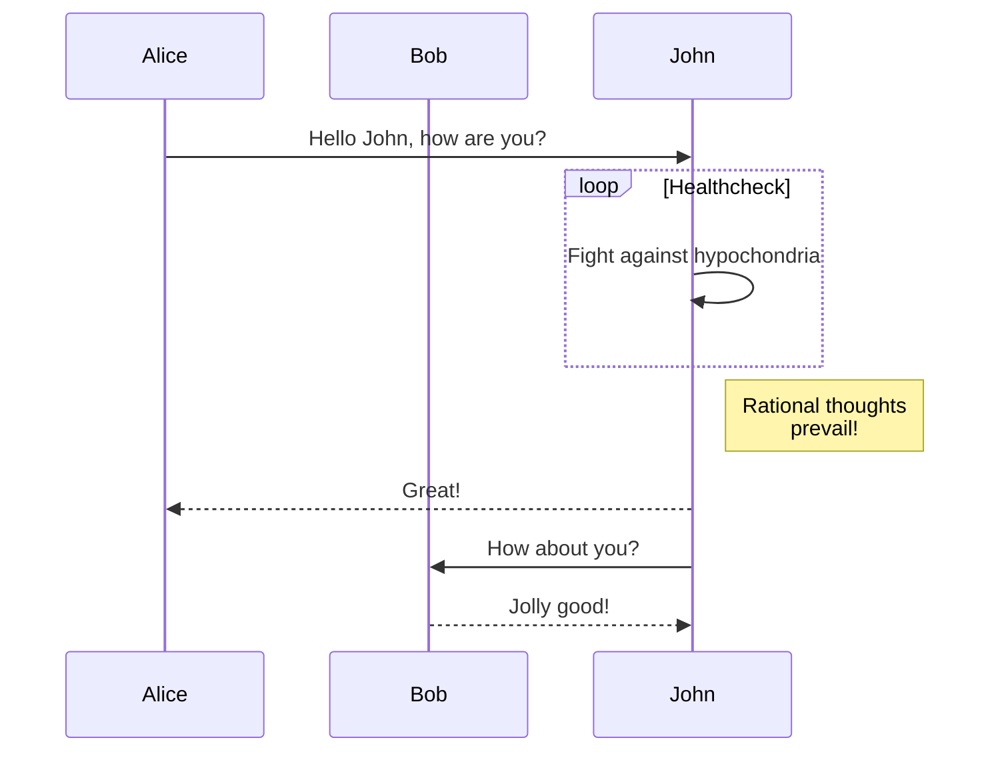

## 基本语法{#base-syntax}
Go 模板是添加了 **变量** 和 **函数** 的 HTML 文件，变量和函数需要在 `{{...}}` 中使用

content 目录中存在的所有信息，都可以通过**模板变量**来获取，Hugo 提供了一些顶级变量：
- `$` - 此变量表示模板的顶级上下文。 在页面模板的情况下，此变量表示当前页面。 像标题这样的页面级元数据以 `$.Title` 的形式提供，而描述以 `$.Description` 的形式提供。 页面级变量通过`Page` 属性链接到自身，因此我们可以将网站的标题写为 `$.Page.Title`。

```go-html-template
<!-- 获取文章 title 的几种取值方式 -->
<h3>测试变量</h3>
<p>title: {{.Title}}</p>
<p>title: {{.Params.title}}</p>
<p>title: {{$.Title}}</p>
<p>title: {{$.Params.title}}</p>
<p>title: {{$.Page.Title}}</p>
<p>title: {{$.Page.Params.title}}</p>
```
以上几种方式都可以去到 `Front matter` 中 `title` 的值

> 注意：
- Front matter 中自定义的属性，只能通过 `.Params`、`$.Params` 和 `$.Page.Params`的属性来取值，后跟的属性，首字母大小和小写有效；并且 Params 不仅可以取**自定义属性**，同样也能取到**预设属性**
- `$.Page` 后面的属性，首字母必须要大写，小写会报错；

```bash
echo 'export HOMEBREW_BOTTLE_DOMAIN=https://mirrors.ustc.edu.cn/homebrew-bottles' >> ~/.zshrc
source ~/.zshrc
brew update
```



```
git -C "$(brew --repo)" remote set-url origin https://mirrors.tuna.tsinghua.edu.cn/git/homebrew/brew.git

git -C "$(brew --repo homebrew/core)" remote set-url origin https://mirrors.tuna.tsinghua.edu.cn/git/homebrew/homebrew-core.git

git -C "$(brew --repo homebrew/cask)" remote set-url origin https://mirrors.tuna.tsinghua.edu.cn/git/homebrew/homebrew-cask.git
//  更新
brew update
```